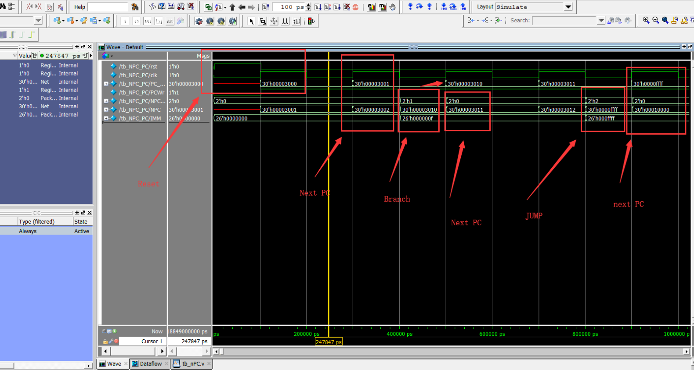

# courseProject_ComputerArchitecture

# 1. 计算机组成与系统结构实验报告

# 2. 概述

## 2.1. 作者

计算机学院10011601班刘濠赫（2016300219）

## 2.2. 作品概述

使用verilog编写多周期CPU，支持add, subu, jal, ori, lw, sw, beq指令 

## 2.3. 开发环境

Modelsim 10.2

# 3. 模块测试：Verilog & Testbench & wave chart

## 3.1. Register file

### 3.1.1. RegFile.v

```verilog
`timescale 1ns / 1ps

//A1:register1 to read,A2:register2 to read,WriteReg:register to write
//WD:the data we need to write
//RorW:choose if write enabled
//clk:clock signal ,reset:set all registers to 0
//RD1 ,RD2: the output data from register file

module RegFile (A1, A2, WriteReg, WD, RorW, clk,RD1, RD2,rst);
	input [4:0]	A1, A2, WriteReg;
	input [31:0] WD;
	input	RorW, clk,rst;
	output [31:0] RD1, RD2;	//
	reg [31:0] register [0:31]; //32 registers totally
	integer i;

	assign RD1 = (A1 == 0) ? 0 : register[A1];
	assign RD2 = (A2 == 0) ? 0 : register[A2];
	initial 
	begin
	
	end
	always @(posedge clk) begin
		begin
			if(rst XQ== 1)
			begin
				for(i=0;i<32;)
				begin
					register[i]<=0;
					i=i+1;
				end
			end
			if (WriteReg != 0 && RorW== 1)
				register[WriteReg] <= WD;
		end
	end
endmodule
```

### 3.1.2. tb_RegFile.v

```verilog
`timescale 1ns/1ps 
module tb_RegFile ;
reg [4:0] A1_test,A2_test,WriteReg_test;
reg [31:0] WD_test;
reg RorW_test,clk_test;
wire [31:0]RD1_test,RD2_test;

initial
begin
A1_test = 0;
A2_test = 0;
WriteReg_test = 0;
WD_test = 0;
RorW_test = 0;
clk_test = 0;
end

always #30 clk_test=~clk_test;

initial
begin
#30
WD_test = 256;
WriteReg_test = 10;
RorW_test = 1;
#30
WD_test = 65535;
WriteReg_test = 11;
RorW_test = 1;
#30
A1_test = 10;
A2_test = 11;
#30
RorW_test = 0;
end


RegFile UUT_D_RegFile(.A1(A1_test),.A2(A2_test),.WriteReg(WriteReg_test),.WD(WD_test),.RorW(RorW_test),.clk(clk_test),.RD1(RD1_test),.RD2(RD2_test));

endmodule
```

### 3.1.3. wave chart


Firstly I wrote each data into register $10 and $11 than read them out. The result shows the data can be both write and read correctly.

## 3.2. PC & NPC

### 3.2.1. PC.v

```verilog
`timescale 1ns / 1ps

module PC( clk, rst, PCWr, NPC, PC );              
input         clk;   
input         rst; //reset pc to 32'h0000_3000  
input         PCWr;   
input  [31:2]  NPC;   
output reg [31:2]  PC;

always @(posedge clk) 
	begin
		if(rst == 1)
			PC <= 32'h00000000;
		if (rst == 0 && PCWr== 1)
			PC <= NPC;
	end

endmodule
```

### 3.2.2. nPC.v

```verilog
`timescale 1ns / 1ps
module NPC( PC, NPCOp, IMM, NPC );
    
   input  wire [31:2] PC;
   input  [1:0]  NPCOp;
   input  [25:0] IMM;
   output [31:2] NPC;
   
   reg [31:2] NPC;
   
   always @(*) begin
      case (NPCOp)
          2'b00: NPC = PC + 1;
	    //Signed extension
          2'b01: NPC = PC + {{14{IMM[15]}}, IMM[15:0]};
          2'b10: NPC = {PC[31:28], IMM[25:0]};
          default: ;

      endcase
   end
   
endmodule
```

### 3.2.3. tb_nPC.v

```verilog
`timescale 1ns/1ps 
module tb_NPC_PC ;
reg  [1:0]  NPCOp; // PLUS4(2'b00), BRANCH(2'b01), JUMP(2'b10)  
reg  [25:0] IMM; 
wire [31:2] NPC; 

wire [31:2] PC_out;
reg PCWr,rst,clk;

NPC UUT_D_NPC(.PC(PC_out), .NPCOp(NPCOp), .IMM(IMM), .NPC(NPC) );
PC UUT_D_PC(.clk(clk), .rst(rst), .PCWr(PCWr), .NPC(NPC), .PC(PC_out));

initial
begin
PCWr = 0;
rst = 0; 
clk = 0;
NPCOp = 2'b00;
IMM = 0;
end

always #100 clk=~clk;

initial 
begin
#2
//RESET
rst = 1;#100
rst = 0;
PCWr = 1;#300
//BRANCH
NPCOp = 2'b01;
IMM[3:0] = 8'b11111111;#100
//PLUS
NPCOp = 2'b00; #300
//JUMP
NPCOp = 2'b10;
IMM[15:0] = 16'hffff;#100
//PLUS
NPCOp = 2'b00; 
end
endmodule
```

### 3.2.4. wave chart

module PC and NPC are tested together



Firstly I set rst = 1 so as to reset the circuit, than I tried different NPCOp: next PC, Branch and Jump, the result shows it works correctly.

## 3.3. Extender

### 3.3.1. EXT.V

```verilog
module EXT( Imm16, EXTOp, Imm32 );
    
   input  [15:0] Imm16;
   input  [1:0]  EXTOp;
   output [31:0] Imm32;
   
   reg [31:0] Imm32;
    
   always @(*) begin
      case (EXTOp)
         2'b00:    Imm32 = {16'd0, Imm16};
         2'b01:  Imm32 = {{16{Imm16[15]}}, Imm16};
         2'b10: Imm32 = {Imm16, 16'd0};
         //default: ;
      endcase
   end 
    
endmodule

```

### 3.3.2. tb_EXT.v

```verilog
`timescale 1ns/1ps 
module tb_EXT ;

reg [15:0] Imm16;
reg [1:0]  EXTOp;

wire [31:0] Imm32;
EXT UUT_D_EXT( .Imm16(Imm16), .EXTOp(EXTOp), .Imm32(Imm32) );

initial
begin
EXTOp = 2'b00;
Imm16 = 16'h000f;
Imm16 = 16'hf000;
end

initial 
begin
#100
//signed
EXTOp = 2'b01;
Imm16 = 16'h000f;
Imm16 = 16'hf000;#100
//highpos
EXTOp = 2'b10;
Imm16 = 16'h000f;#100
Imm16 = 16'hf000;
end
endmodule
```

### 3.3.3. wave chart


For the input 16-bits immediate, use signed extend ,unsigned extend and HIGHPOS to do extension

## 3.4. ALU

### 3.4.1. ALU.v

```verilog
module ALU (A, B, ALUOp, C, Zero);        
   input  [31:0] A, B;
   input  [4:0]  ALUOp;
   output reg [31:0] C;
   output        Zero;

   always @(*) begin
      case ( ALUOp )
         5'b00011: C = A + B;
         5'b00001: C = A - B;
         5'b00111: C = A | B;
         default:   ;
      endcase
   end
   
   assign Zero = (A == B) ? 1 : 0;

endmodule
   
```

### 3.4.2. tb_ALU.v

```verilog
module tb_ALU ;
reg  [31:0] A, B;
reg  [4:0]  ALUOp;
wire [31:0] C;
wire   Zero;

ALU UUT_D_ALU(.A(A), .B(B), .ALUOp(ALUOp), .C(C), .Zero(Zero));

initial 
begin
A = 32'h00000000;
B = 32'd00000000;
ALUOp  = 5'b00000;
end

initial 
begin
#100
ALUOp = 5'b00011;
A = 32'h0000ffff;
B = 32'd00000001;#100 //add

ALUOp = 5'b00101;#100 //sub
ALUOp = 5'b00111;#100 //or
A = 32'h000000ff;
B = 32'h000000ff;
ALUOp = 5'b00101;#100
A = 32'h00000000;
B = 32'h00000000;


end


endmodule

```

### 3.4.3. wave chart


set A,B with two different value and try :add, sub and or. We can see that *Zero* bit also works if A equals B

## 3.5. Instruction Register

### 3.5.1. IR.v

```verilog
module IR (clk, rst, IRWr, im_dout, instr);
               
   input         clk;
   input         rst;
   input         IRWr; 
   input  [31:0] im_dout;
   output [31:0] instr;
   reg [31:0] instr;   
     
   always @(posedge clk or posedge rst) begin
      if ( rst ) 
         instr <= 0;
      else if (IRWr)
         instr <= im_dout;
   end       
endmodule

```

## 3.6. Multiplexer

### 3.6.1. MUX.v

```verilog
module mux2 #(parameter WIDTH = 8)(d0, d1, s, y);
    input  [WIDTH-1:0] d0, d1;
    input              s;
    output reg [WIDTH-1:0] y;          
         
    always@(*)
	begin
	y = ( s == 1'b1 ) ? d1:d0;
	end
    
endmodule

module mux4 #(parameter WIDTH = 8)(d0, d1, d2, d3, s, y);
    
    input  [WIDTH-1:0] d0, d1, d2, d3;
    input  [1:0] s;
    output reg [WIDTH-1:0] y;
    
    
    always @( * ) begin
        case ( s )
            2'b00: y = d0;
            2'b01: y = d1;
            2'b10: y = d2;
            2'b11: y = d3;
            default: ;
        endcase             
    end 
endmodule

module mux8 #(parameter WIDTH = 8)(d0, d1, d2, d3,d4, d5, d6, d7,s, y);
    
    input  [WIDTH-1:0] d0, d1, d2, d3;
    input  [WIDTH-1:0] d4, d5, d6, d7;
    input  [2:0]       s;
    output reg [WIDTH-1:0] y;
    
    always @( * ) begin
        case ( s )
            3'd0: y = d0;
            3'd1: y = d1;
            3'd2: y = d2;
            3'd3: y = d3;
            3'd4: y = d4;
            3'd5: y = d5;
            3'd6: y = d6;
            3'd7: y = d7;
            default: ;
        endcase
    end    
endmodule

module mux16 #(parameter WIDTH = 8)(d0, d1, d2, d3,d4, d5, d6, d7,d8, d9, d10, d11,d12, d13, d14, d15,s, y);
    
    input [WIDTH-1:0] d0, d1, d2, d3;
    input [WIDTH-1:0] d4, d5, d6, d7;
    input [WIDTH-1:0] d8, d9, d10, d11;
    input [WIDTH-1:0] d12, d13, d14, d15;
    input [3:0] s;
    output reg [WIDTH-1:0] y;

    always @( * ) begin
        case ( s )
            4'd0:  y = d0;
            4'd1:  y = d1;
            4'd2:  y = d2;
            4'd3:  y = d3;
            4'd4:  y = d4;
            4'd5:  y = d5;
            4'd6:  y = d6;
            4'd7:  y = d7;
            4'd8:  y = d8;
            4'd9:  y = d9;
            4'd10: y = d10;
            4'd11: y = d11;
            4'd12: y = d12;
            4'd13: y = d13;
            4'd14: y = d14;
            4'd15: y = d15;
            default: ;
        endcase
    end  
    
endmodule


```

### 3.6.2. tb_mux.v

```verilog
module mux_test;

reg  [7:0] A, B, C, D;
reg  [31:0] E, F, G, H,I,J,K,L;
//Select signal
reg   S1;
reg  [1:0] S2;
reg  [2:0] S3;
//Output 
wire [7:0] y1;
wire [31:0] y3_4,y3_8;


mux2 #(8) UUT_D_MUX_2_8 (.d0(A), .d1(B),.s(S1), .y(y1));

mux4 #(32) UUT_D_MUX_4_32 (.d0(E), .d1(F), .d2(G), .d3(H),.s(S2), .y(y3_4));

mux8 #(32) UUT_D_MUX_8_32 (.d0(E), .d1(F), .d2(G), .d3(H),.d4(I), .d5(J), .d6(K), .d7(L),.s(S3), .y(y3_8));

initial
begin
A = 8'h1f;
B = 8'h2f;
C = 8'h3f;
D = 8'h4f;

E = 32'hffff1111;
F = 32'hffff2222;
G = 32'hffff3333;
H = 32'hffff4444;
I = 32'hffff5555;
J = 32'hffff6666;
K = 32'hffff7777;
L = 32'hffff8888;

S1 = 1'b0;
S2 = 2'b00;
S3 = 3'b000;
end

initial 
begin #100
S1 = 1'b1;#100
S1 = 1'b0;#100
S2 = 2'b01;#100
S2 = 2'b10;#100
S2 = 2'b11;#100
S3 = 3'b000;#100
S3 = 3'b010;#100
S3 = 3'b100;
end


endmodule

```

### 3.6.3. wave chart

Here I initialize three multiplexer


## 3.7. Instruction memory

### 3.7.1. IM.v

```verilog
module im_4k( addr, dout ,clk,rst);
    
    input [29:0] addr;
    output [31:0] dout;
    input rst,clk;
    reg [31:0] mem[1023:0];
    integer i;
    assign dout = mem[addr[9:0]];
    always@(posedge clk)
	begin
		if(rst == 1)
		begin
			for(i=0;i<1024;)
			begin
				mem[i]<=0;
				i=i+1;
			end
		end
	end
endmodule    


```

### 3.7.2. tb_IM.v

```verilog
 module tb_IM();
    
   reg [31:0]address;
   wire[31:0]out;
    
   im_4k UUT_D_ALU_IM( .addr(address[31:2]), .dout(out) );
   
    
   initial begin
      $display("Readfile!");
      $readmemh( "D:/senior(2)/ComputerArchExp/MyCPU/Experiment/test.txt" , UUT_D_ALU_IM.mem ) ;
      address = 32'h000000000;
      while(1)
      begin
      #100
      address = address + 4;
      end
   end

   
endmodule

```

### 3.7.3. wave chart


## 3.8. Data memory

### 3.8.1. DM.v

```verilog
module dm_4k( addr, din, DMWr, clk, dout,rst );
   
   input [31:0] addr,din;
   input DMWr,clk,rst;
   output [31:0] dout;
   reg [31:0] dmem[1023:0]; 
   integer i;

   always @(posedge clk) begin
     if(rst == 1)
	begin
		for(i=0;i<1024;)
		begin
			dmem[i]<=0;
			i=i+1;
		end
	end
      if (DMWr)
         dmem[addr] <= din;
   end   
   
   assign dout = dmem[addr[9:0]];
    
endmodule    

```

### 3.8.2. tb_DM.v

```verilog
module tb_DM;
reg [31:0] address;
reg [31:0] data_in;
reg DMWr, clock;
wire [31:0] data_out;


dm_4k data_memory( .addr(address), .din(data_in), .DMWr(DMWr), .clk(clock), .dout(data_out));

always
begin
#50
clock = ~clock; 
end


initial
begin
clock = 1'b0;
DMWr= 1'b0;
address = 32'h0000_0000;
data_in = 32'hffff_ffff;

#10
DMWr= 1'b1;

#100
data_in = 32'h0000_0100;
address = 32'h0000_0010;

#100
data_in = 32'h0000_0200;
address = 32'h0000_0020;

#100
DMWr= 1'b0;
address = 32'h0000_0010;
#30
address = 32'h0000_0020;

end

endmodule

```

### 3.8.3. wave chart


## 3.9. Register between stages

### 3.9.1. flopr.v

```verilog
`timescale 1ns / 1ps
module flopr #(parameter WIDTH = 8)(clk, rst, d, q);
               
   input              clk;
   input              rst;
   input  [WIDTH-1:0] d;
   output [WIDTH-1:0] q;
   reg [WIDTH-1:0] q_r;
               
   always @(posedge clk or posedge rst) begin
      if ( rst ) 
         q_r <= 0;
      else 
         q_r <= d;
   end 
   
   assign q = q_r;
      
endmodule

```

# 4. 顶层模块

## 4.1. mips.v

### 4.1.1. Scheme

- Registers between stages


- Data memory and register file

  

- extender and ALU

  

- Instruction fetch and control unit

  

### 4.1.2. Verilog Code

```verilog
`timescale 1ns / 1ps
module mips( clk, rst );
   input   clk,rst;
   
   wire RFWr,DMWr,PCWr,IRWr,BSel,Zero;
   wire [1:0]  EXTOp,NPCOp,GPRSel,WDSel;
   wire [4:0] ALUOp;
   wire [29:0] PC, NPC;
   wire [31:0] im_dout, dm_dout,DR_out,instr;
   wire [4:0]  rs,rt,rd;
   wire [5:0]  Op,Funct;
   wire [15:0] Imm16; 
   wire [31:0] Imm32;
   wire [25:0] IMM;
   wire [4:0]  A3;
   wire [31:0] WD;
   wire [31:0] RD1, RD1_r, RD2, RD2_r;
   wire [31:0] B, C, C_r;
   
   assign Op = instr[31:26];
   assign Funct = instr[5:0];
   assign rs = instr[25:21];
   assign rt = instr[20:16];
   assign rd = instr[15:11];
   assign Imm16 = instr[15:0];
   assign IMM = instr[25:0];
   
   NPC U_NPC (.PC(PC), .NPCOp(NPCOp), .IMM(IMM), .NPC(NPC));    

   PC U_PC (.clk(clk), .rst(rst), .PCWr(PCWr), .NPC(NPC), .PC(PC));  

   im_4k U_IM (.addr(PC) , .dout(im_dout),.clk(clk),.rst(rst)); 

   IR U_IR (.clk(clk), .rst(rst), .IRWr(IRWr), .im_dout(im_dout), .instr(instr));  

   ctrl U_CTRL (.clk(clk),	.rst(rst), .Zero(Zero), .Op(Op),  .Funct(Funct),.RFWr(RFWr),.DMWr(DMWr),.PCWr(PCWr),.IRWr(IRWr),
      .EXTOp(EXTOp), .ALUOp(ALUOp), .NPCOp(NPCOp), .GPRSel(GPRSel),.WDSel(WDSel), .BSel(BSel));

   mux4 #(5) U_MUX4_GPR_A3 (.d0(rd), .d1(rt), .d2(5'd31), .d3(5'd0),.s(GPRSel), .y(A3));   //choose A3

   RegFile U_RegFile (.A1(rs), .A2(rt), .WriteReg(A3), .WD(WD), .clk(clk), .RorW(RFWr), .RD1(RD1), .RD2(RD2),.rst(rst));  //connect to register file
      
   flopr #(32) U_RD1_Reg (.clk(clk), .rst(rst), .d(RD1), .q(RD1_r));  //store data from register file in register RD1

   flopr #(32) U_RD2_Reg (.clk(clk), .rst(rst), .d(RD2), .q(RD2_r));  //store data from register file in register RD2   

   EXT U_EXT ( .Imm16(Imm16), .EXTOp(EXTOp), .Imm32(Imm32) );  //extend Imm
   
   mux2 #(32) U_MUX_ALU_B (.d0(RD2_r), .d1(Imm32), .s(BSel) , .y(B));  //choose B
   
   ALU U_ALU ( .A(RD1_r), .B(B), .ALUOp(ALUOp), .C(C), .Zero(Zero));  //alu
   
   //register for ALU output
   flopr #(32) U_ALUOut (.clk(clk), .rst(rst), .d(C), .q(C_r));  //store result

   dm_4k U_DM (.addr(C_r), .din(RD2_r), .DMWr(DMWr), .clk(clk), .dout(dm_dout),.rst(rst));

   //The register for data memory reading
   flopr #(32) U_DR (.clk(clk), .rst(rst), .d(dm_dout), .q(DR_out));

/*ALUOUT,DATAMEMORY_OUT,PC:Choose the data we use to write back to register file-WD
That can be the result from ALU ,or the data from memory or update pc*/
   mux4 #(32) U_MUX4_GPR_WD (.d0(C_r), .d1(DR_out), .d2({PC,2'b00}), .d3(32'd0),.s(WDSel), .y(WD));

endmodule

```


### 4.1.3. tb_mips.v

```verilog
`timescale 1ns / 1ps
module mips_tb();
// readmemh problem
//overflow problem
//reset problem
// alu vs. ALU
//16-bits immediate overflows
   reg clk, rst;
   mips U_MIPS(
      .clk(clk), .rst(rst)
   );
   initial begin
//attension: the slide used here only can be '/' but not '\'
      clk = 1 ;
      rst = 0 ;
      #5 ;
      rst = 1 ;
      #105 ;
      rst = 0 ;
      $readmemh( "D:/senior(2)/ComputerArchExp/MyCPU/Experiment/test1.txt" , U_MIPS.U_IM.mem ) ;
   end
   
   always
       #(20) clk = ~clk;
   
endmodule

```

时钟周期为20ns

## 4.2. 状态机


- Fetch：首先从instruction memory中Fetch一条指令
- DCD：将Fetch的结果进行Decode，得到rd，rt，rs，imm16，opt，func等字段
- 对于R/I型指令，在EXE状态进行加减和或的运算，在控制信号产生时要根据不同的指令生成不同的ALUop（对于这三种运算的EXTop都是无符号拓展），在进行ori运算时要给Bsel赋予适当的信号，来选择立即数作为ALU input，在结束了计算之后（EXE阶段），需要将运算结果进行写回，进入WB（write back）阶段，其中要写回的寄存器要根据R/Itype指令的不同来选择合适的寄存器
- 如果发现指令为lw或者sw，则进入MA（memory access）阶段，然后根据lw和sw选择对应阶段
  - MR（memory read）阶段，在读完datamemory得到数据之后，需要写回register file，所以还要进入MEMRB阶段
  - MW（memory write）阶段
- 如果在op字段发现为beq，则进入branch阶段。在这个状态中要判断ALU的输出zero是否为0
- 如果在op字段发现为jal指令，则进入JMP状态，注意这个状态中要将$ra寄存器的值更新为当前pc指针的值

注：所有终态的下一个状态均为Fetch

## 4.3. 控制单元

### 4.3.1. ctrl.v

```verilog
module ctrl(clk,	rst, Zero, Op, Funct,RFWr, DMWr, PCWr, IRWr,EXTOp, ALUOp, NPCOp, GPRSel,WDSel, BSel);
    
   input  clk, rst, Zero;       
   input  [5:0] Op,Funct;
   /*write data memory
   write pc register
	write IR register*/
   output  reg     RFWr,DMWr,PCWr,IRWr;		//register file write or read

   /*
   EXTOp: signed or unsigned	
   ALUOp: add sub or
   NPCOp: 00,01,10
   GPRSel: select A3
   WDSel: mux write data selection
   BSel: select the source for ALU B port
   */
   output reg [1:0] EXTOp,NPCOp,GPRSel,WDSel;	
   output reg [4:0] ALUOp;
   output reg BSel; 		
   
   parameter Fetch = 4'b0000;
   parameter DCD = 4'b0001;
   parameter Exe = 4'b0010;
   parameter MA = 4'b0011;
   parameter Branch = 4'b0100;
   parameter Jmp = 4'b0101;
   parameter MR = 4'b0110;
   parameter MW = 4'b0111;
   parameter WB = 4'b1000;
   parameter MemWB = 4'b1001;
    
	
   wire RType,IType,BrType,JType,LdType,StType,MemType;   
	
   /**
   *Type of instruction: addu,subu,ori,lw,sw,jal,beq
   */

   assign RType = (Op == 6'b000000); //Rtype
   assign IType = (Op == 6'b001101); //ori
   assign BrType = (Op == 6'b000100); //beq
   assign JType = (Op == 6'b000011); //jal
   assign LdType = (Op == 6'b100011); //lw
   assign StType = (Op == 6'b101011);  //sw
   assign MemType = LdType || StType;
    
   reg [3:0] nextstate,state;

		
	always @( * ) begin
	   case ( state ) 
          Fetch: begin
            PCWr   = 1'b1;
            NPCOp  = 2'b00; //npc_mode: plus 4
            IRWr   = 1'b1;
            RFWr   = 1'b0;
            DMWr   = 1'b0;
            EXTOp  = 2'b0;
            GPRSel = 2'b0;
            WDSel  = 2'b0;
            BSel   = 1'b0;
            ALUOp  = 5'b00000;
	                end 

         DCD: begin
            PCWr   = 1'b0;
            NPCOp  = 2'b0;
            IRWr   = 1'b0;
            RFWr   = 1'b0;
            DMWr   = 1'b0;
            EXTOp  = 2'b0;
            GPRSel = 2'b0;
            WDSel  = 2'b0;
            BSel   = 1'b0;
            ALUOp  = 5'b00000;
			end

          Exe: 	begin
            PCWr   = 1'b0;
            NPCOp  = 2'b0;
            IRWr   = 1'b0;
            RFWr   = 1'b0;
            DMWr   = 1'b0;
            if (Op == 6'b001101)//ori 
               EXTOp = 2'b00;
            else
               EXTOp = 2'b0;
            GPRSel = 2'b0;
            WDSel  = 2'b0;
            DMWr   = 1'b0;
            if (IType)
               BSel   = 1'b1;
            else
               BSel   = 1'b0;
            if (Op == 6'b001101) //ori
               ALUOp = 5'b00111; //alu_or operation
            else if (Op == 6'b000000) //Rtype
             begin
               case (Funct)
                   6'b100001: ALUOp = 5'b00011; //addu
                   6'b100011: ALUOp = 5'b00001; //subu
                   default: 
                   ALUOp = 5'b00000;
               endcase
            end
			end   

         MA: begin
            PCWr   = 1'b0;
            NPCOp  = 2'b0;
            IRWr   = 1'b0;
            RFWr  = 1'b0;
            DMWr   = 1'b0;
            EXTOp  = 2'b01;
            GPRSel = 2'b0;
            WDSel  = 2'b0;
            BSel   = 1'b1;
            ALUOp  = 5'b00011;
			end 

         Branch: begin
            if (Zero) 
               PCWr = 1'b1;
            else
               PCWr = 1'b0;
            NPCOp  = 2'b01; //branch npc
            IRWr   = 1'b0;
            RFWr  = 1'b0;
            DMWr   = 1'b0;
            EXTOp  = 2'b01; //signed
            GPRSel = 2'b0;
            WDSel  = 2'b0;
            BSel   = 1'b0;
            ALUOp  = 5'b00000;
			end 

         Jmp: 	begin
            PCWr   = 1'b1;
            NPCOp  = 2'b10;//jump npc
            IRWr   = 1'b0;
            RFWr   = 1'b1;
            DMWr   = 1'b0;
            EXTOp  = 2'b01; // signed extend
            /*
               jal instruction doesn't have $ra in it.
               We need to add it manully
            */
            //write $ra register
            GPRSel = 2'b10; 
            //Select the source is from PC
            WDSel  = 2'b10;
            BSel   = 1'b0;
            ALUOp  = 5'b00000;
			end 
         MR:  begin
            PCWr   = 1'b0;
            NPCOp  = 2'b0;
            IRWr   = 1'b0;
            RFWr  =  1'b0;
            DMWr   = 1'b0;
            EXTOp  = 2'b0;
            GPRSel = 2'b0;
            WDSel  = 1'b0;
            BSel   = 1'b0;
            ALUOp  = 5'b00000;
			end 
         MW:  begin
            PCWr   = 1'b0;
            NPCOp  = 2'b0;
            IRWr   = 1'b0;
            RFWr   = 1'b0;
            DMWr   = 1'b1; 
            EXTOp  = 2'b0;
            GPRSel = 2'b0;
            WDSel  = 1'b0;
            BSel   = 1'b0;
            ALUOp  = 5'b00000;
			end
         WB: 	begin
            PCWr   = 1'b0;
            NPCOp  = 2'b0;
            IRWr   = 1'b0;
            RFWr   = 1'b1;
            DMWr   = 1'b0;
            EXTOp  = 2'b0;
            if (IType)
               GPRSel = 2'b01; //rt
            else
               GPRSel = 2'b00; //rd
            // write back from alu
            WDSel  = 2'b00; 
            BSel   = 1'b0;
            ALUOp  = 5'b00000;
			end 
         MemWB: begin
            PCWr   = 1'b0;
            NPCOp  = 2'b0;
            IRWr   = 1'b0;
            RFWr   = 1'b1;
            DMWr   = 1'b0;
            EXTOp  = 2'b0;
            //rt
            GPRSel = 2'b01;
            //write back from memory
            WDSel  = 2'b01;
            BSel   = 1'b0;
            ALUOp  = 5'b00000;
			end
			default: begin
            PCWr   = 1'b0;
            NPCOp  = 2'b0;
            IRWr   = 1'b0;
            RFWr   = 1'b0;
            DMWr   = 1'b0;
            EXTOp  = 2'b0;
            GPRSel = 2'b0;
            WDSel  = 1'b0;
            BSel   = 1'b0;
            ALUOp  = 5'b00000;
			end 
	   endcase
   end 
   //Top always
   always @(posedge clk or posedge rst) begin
	   if ( rst )
		   state <= Fetch;
      else
         state <= nextstate;
	end 
   //State trasform      
   always @(*) begin
      case (state)
         Fetch: nextstate = DCD;
         DCD: begin
            if ( RType || IType ) 
				   nextstate = Exe;
            else if ( MemType ) 
               nextstate = MA;
            else if ( BrType )
               nextstate = Branch;
            else if ( JType )
               nextstate = Jmp;
            else 
               nextstate = Fetch;
         end
         Exe:  nextstate = WB;
         //Memory access
         MA: begin 
            if ( LdType )
				   nextstate = MR;  
            else if ( StType )
					nextstate = MW;
			end
         Branch: nextstate = Fetch;
         Jmp: 	nextstate = Fetch;
         MR:   nextstate = MemWB;
         MW:   nextstate = Fetch;
         WB: 	 nextstate = Fetch;
         MemWB: nextstate = Fetch;      
			default: ;

       endcase
   end 

endmodule

```

# 5. 集成测试

## 5.1. 测例：

```python
# ori $t5,0x12c00   //overflow 16-bits immediate
ori $t5,0x900
ori $t1,1023
ori $t2,255
L1:
addu $t3,$t3,$t1 #‭00000001 01101001 01011000 00100001‬
subu $t3,$t3,$t2 #‭00000001 01101010 01011000 00100011‬
sw $t3,0
lw $t4,0
beq $t4,$t5,EXIT
jal L1
EXIT:

```

相当于如下python程序：

```python
num1 = 1023
num2 = 255
result = 0
while(not result == 0x900):
    result += num1
    result -= num2

```

## 5.2. 运行结果

跑起来了


### 5.2.1. 寄存器结果


### 5.2.2. ALU运算

#### 5.2.2.1. add运算


#### 5.2.2.2. sub运算


#### 5.2.2.3. or运算


### 5.2.3. PC和NPC


### 5.2.4. Instruction fetch


### 5.2.5. Register file


# 6. 遇到的一部分问题

## 6.1. 寄存器和各种memory初始化的问题

```verilog
module RF( A1, A2, A3, WD, clk, RFWr, RD1, RD2 );
    
   input  [4:0]  A1, A2, A3;
   input  [31:0] WD;
   input         clk;
   input         RFWr;
   output [31:0] RD1, RD2;
	…
	…
endmodule

```

课堂上给出的module框架没有rst信号，包括instruction memory 和 data memory也没有rst信号，使得寄存器和内存各个单元的初始值不确定，在加入了rst信号之后解决了这个问题

## 6.2. PC指针相对于IM和DM溢出的问题

在调试的过程中发现一段程序会被反复的执行（无视代码逻辑），经过反复调试才发现是因为IM只有4K的大小，而PC指针可以指向一个32位的地址。所以当PC值为0x400的倍数(1024)之后，再增加PC相当于让程序重新开始执行。

## 6.3. 16-bits立即数溢出的问题

在最初的测例中我使用了：

```verilog
ori $t5,0x12c00   //overflow 16-bits immediate

```

而这样的立即数在波形图中显示的只有0x2c00，因为立即数最多是16-bits

## 6.4. modelsim本身软件的BUG

```verilog
 ALU U_ALU ( .A(RD1_r), .B(B), .ALUOp(ALUOp), .C(C), .Zero(Zero));  //alu
 //错误的写为：
 alu U_ALU ( .A(RD1_r), .B(B), .ALUOp(ALUOp), .C(C), .Zero(Zero));  //alu

```

导致对ALU代码的变更一直不起作用，而且modelsim的编译也不报错，运行看上去也很正常

## 6.5. jal指令对$ra寄存器的更新

## 6.6. 关于PC复位时的值

在实验指导PPT中，对PC复位的值给出的是32'h0000_3000，然而这样并不合理
